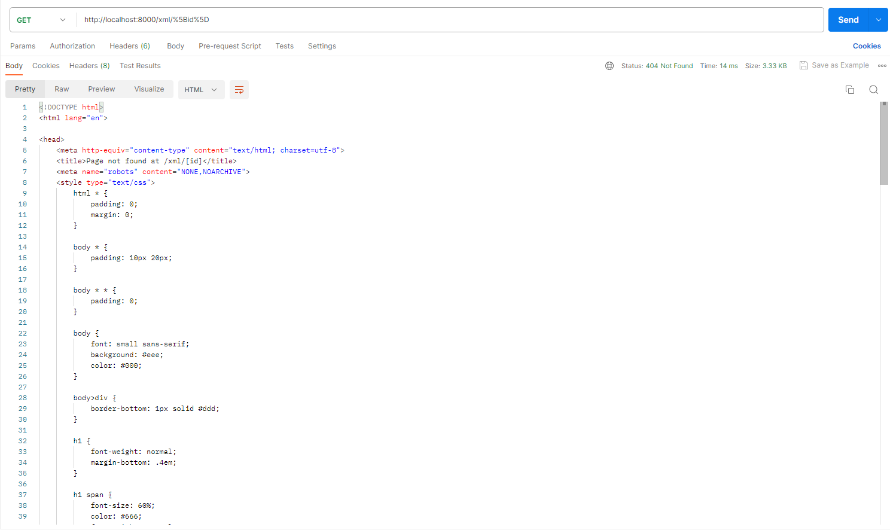
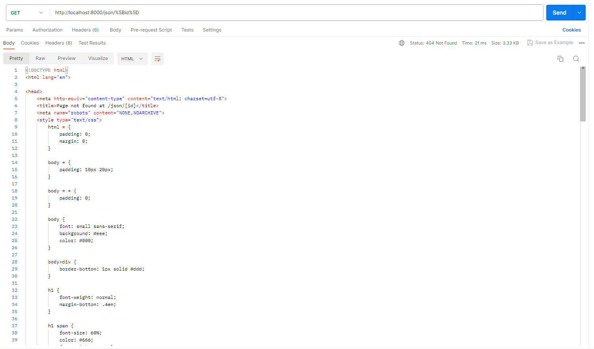
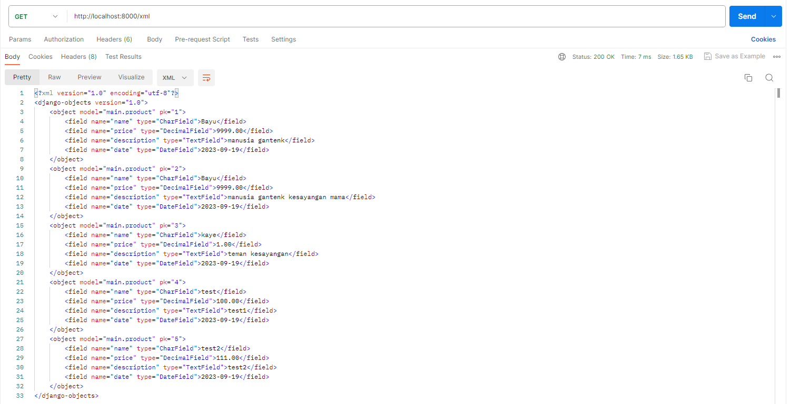

# Nama        : Rizqi Bayu Utama
# NPM         : 2206826330
# Kelas       : PBP - C

## Link Aplikasi
Link untuk Aplikasi [Bayu's Inventory](https://bayuinventory.adaptable.app/main/)


# Jawaban Tugas  2

### 1. Jelaskan bagaimana cara kamu mengimplementasikan checklist di atas secara step-by-step (bukan hanya sekadar mengikuti tutorial)
1. Pertama saya membuat projek django baru dan mengaktifkan virtual environment yang berguna untuk mengisolasi package serta dependencies dari aplikasi. Mengaktifkan virtual environment dengan perintah berikut:

    ```shell
    python -m venv env
    ```
    ```shell
    #Windows
    env\Scripts\activate.bat
    # Linux/Unix, e.g. Ubuntu, MacOS
    source env/bin/activate
    ```

2. Menyiapkan Dependencies (library, framework, package) dengan membuat requirements.txt 
    - jalankan perintah:

    ```shell
    pip install -r requirements.txt
    ```

    - dan buat proyek Django bernama BayuInventory dengan perintah:

    ```shell
    django-admin startproject BayuInventory
    ```

3. Mengonfigurasi proyek dan menjalankan server
    - Menambahkan `"*"` pada `ALLOWED_HOST` di `settings.py` untuk keperluan deploy
    - Menjalankan command:

    ```shell
    python manage.py runserver 
    ``` 

    - cek di http://localhost:8000 untuk melihat apakah berhasil atau tidak

4. Membuat aplikasi main dalam Proyek
    - jalankan 
    ```shell
    python manage.py startapp main
    ```

    - Mendaftarkan aplikasi `main` pada `INSTALLED_APPS` di `settings.py`

5. Buat direktori bernama `templates` didalam direktori main dan buat file `main.html` yang akan berisi template bagaimana tampilan web nanti

6. Mengubah `models.py` sesuai dengan yang dibutuhkan atau diinginkan

7. Membuat dan mengaplikasikan Migrasi Model
    - melakukannya dengan cara menjalankan perintah 

    ```shell 
    python manage.py makemigrations
    ```
    - Penerapan migrasi dengan

    ```shell
    python manage.py migrate 
    ```

8. Menghubungkan views dengan template
    - Tambahkan code berikut pada `views.py` di dalam aplikasi `main` 

    ```shell
    from django.shortcuts import render 
    ```

    - Menambahkan fungsi show_main yang akan mengembalikan tampilan yang sesuai

9. Konfigurasi URL
    - Konfigurasi url agar aplikasi main dapat diakses melalui web
    - jalankan proyek 

10. Melakukan Deploy pada Adaptable

### 2. Buatlah bagan yang berisi request client ke web aplikasi berbasis Django beserta responnya dan jelaskan pada bagan tersebut kaitan antara urls.py, views.py, dan models.py, dan berkas html


### 3. Jelaskan mengapa kita menggunakan virtual environment, apakah bisa membuat aplikasi web berbasis Django tanpa virtual environment?

Alasan menggunakan virtual environment adalah agar ketika rilis Django versi baru kita tetap dapat menjalankan aplikasi kita tanpa masalah seperti masalah perubahan fungsi ataupun tidak bisa berjalan pada modul terbaru. 

Kita tetap bisa membuat aplikasi web berbasis Django tanpa virtual environment, namun dengan resiko seperti yang sudah dijelaskan diatas.

### 4. Jelaskan apakah itu MVC, MVT, MVVM dan perbedaan ketiganya
- MVT: arsitektur untuk memisahkan konponen utama dari sebuah aplikasi (Model, View, Template)
- MVC: framework yang memisahkan aplikasi menjadi 3 logical components (Model, View, Controller)
- MVVM: arsitektur yang memisahkan code menjadi 3 bagian (Model, View, ViewModel)

    Perbedaaan: MVT lebih sederhana dengan Template yang fokus pada tampilan, MVC menggunakan Controller untuk mengendalikan alur aplikasi, sedangkan MVVM memperkenalkan ViewModel untuk mengelola tampilan dan memisahkan logika bisnis dari tampilan. 

# Jawaban Tugas 3

### 1. Perbedaan antara form `POST` dan form `GET` dalam Django?
- **`POST`**:
    - Mengirim informasi ke tujuan tanpa menampilkannya pada URL
    - Variabel `$_POST` menampung informasi yang dikirim
    - Memungkinkan pengiriman informasi dalam jumlah besar tanpa batasan khusus
- **`GET`**:
    - Mengirim informasi dengan menampilkan data di URL
    - Variabel `$_GET` menampung informasi dari URL
    - Keterbatasan panjang URL: hingga 2047 karakter

### 2. Perbedaan antara `XML`, `JSON`, dan `HTML` dalam konteks pengiriman data?
- **`XML`**:
    - Fasilitasi pertukaran data dengan format yang kuat melalui tag-tag khusus
    - Berguna untuk konfigurasi aplikasi dan integrasi lintas platform

- **`JSON`**:
    - Menyajikan data dengan format intuitif, menyerupai notasi objek
    - Ideal untuk komunikasi web dan API

- **`HTML`**:
    - Fokus pada tampilan konten di browser
    - Mengatur tampilan dan interaksi konten

### 3. Mengapa JSON sering digunakan dalam pertukaran data antara aplikasi web modern?
- **Ringkas dan Mudah Dibaca.**
- **Mendukung Struktur Data yang Kompleks.** 
- **Ringan dan Efisien.**
- **Responsif untuk Aplikasi Web.**

### 4. Jelaskan bagaimana mengimplementasikan checklist di atas secara step-by-step
1. Mengembangkan form input:
    - Membuat `forms.py` di dalam folder "main". Hal ini untuk membuat struktur form yang dapat menerima data produk baru
    - Pada `views.py` definisikan fungsi dengan nama `create_product` yang berguna dalam proses pengisian form
    - Menambahkan fungsi untuk merender `create_product.html`
    - Menambahkan `products = Product.objects.all()` di fungsi `show_main` pada `views.py` 
    - Import fungsi `create_product` yang baru tadi dibuat, lalu tambahkan path url pada `urls.py` untuk bisa diakses
    - Buat file `create_product.html` dalam folder "templates" di main
    - Tambahkan kode di `main.html` untuk menampilkan data item dalam bentuk tabel dan menambahkan tombol "Add New Item" yang mengarahkan ke halaman pengisian item yang ingin ditambahkan
2. Menyediakan fungsi views dalam berbagai format:
    - Di dalam `views.py` definisikan fungsi `show_xml` lalu tambahkan path url agar dapat mengakses fungsi tersebut
    - Definisikan fungsi `show_json` di `views.py` lalu ulangi hal yang sama pada fungsi `show_xml`
    - Definisikan fungsi `show_json_by_id` (untuk json) dan `show_xml_by_id` (untuk xml) dan tambahkan path url ke dalam `urlpatterns` untuk mengakses fungsi.

### 5. Mengakses kelima URL





# Jawaban Tugas 4

### 1. Apa itu Django `UserCreationForm`, dan jelaskan apa kelebihan dan kekurangannya?
Django UserCreationForm adalah salah satu komponen framework Django yang digunakan untuk membuat user registration form dalam aplikasi web yang memungkinkan user untuk membuat akun baru.
1. Kelebihan:
    - Mudah digunakan
    - Fleksibel
    - terintegrasi dengan Model User Django
    - Kompatibel dengan Django's Authentication System
2. Kekurangan:
    - Tidak mendukung fitur lanjutan
    - Tidak menjamin keamanan
    - Memerlukan penanganan kesalahan tambahan

### 2. Apa perbedaan antara autentikasi dan otorisasi dalam konteks Django, dan mengapa keduanya penting?
    Autentikasi adalah proses verifikasi identitas pengguna yang mencoba mengakses sistem atau aplikasi. Ini adalah langkah awal untuk menentukan siapa pengguna yang mencoba mengakses sumber daya.

    Otorisasi adalah proses yang terjadi setelah autentikasi dan melibatkan pengendalian akses pengguna ke sumber daya tertentu atau tindakan dalam aplikasi. Ini berkaitan dengan perizinan yang diberikan kepada pengguna yang sudah terautentikasi.

    Dalam kombinasi, autentikasi dan otorisasi membantu memastikan bahwa pengguna yang telah diotentikasi memiliki akses yang sesuai dan aman ke sumber daya dalam aplikasi 

### 3. Apa itu cookies dalam konteks aplikasi web, dan bagaimana Django menggunakan cookies untuk mengelola data sesi pengguna?
    Cookies adalah mekanisme kecil yang digunakan dalam pengembangan aplikasi web untuk menyimpan data pada sisi klien 

    Django memanfaatkan cookies untuk mengelola data sesi pengguna dengan cara:
        - Membuat Sesi: Menghasilkan sesi pengguna dan ID sesi unik saat pertama kali masuk
        - Menyimpan Data Sesi: Menyimpan informasi sesi dalam cookies dan mengenkripsinya jika diperlukan
        - Mengakses Data Sesi: Membaca cookies pengguna saat permintaan berikutnya
        - Memperbarui Data Sesi: Memperbolehkan pembuat untuk memperbarui data sesi pengguna
        - Mengakhiri Sesi: Menghapus data sesi saat pengguna keluar atau sesi berakhir

### 4. Apakah penggunaan cookies aman secara default dalam pengembangan web, atau apakah ada risiko potensial yang harus diwaspadai?
    Penggunaan cookies tidak selalu aman, ada risiko potensial yang harus diwaspadai seperti:
    1. Kemanan data
    2. Serangan Cross-Site Scripting
    3. Cookie Theft

### 5. Jelaskan bagaimana cara kamu mengimplementasikan checklist di atas secara step-by-step (bukan hanya sekadar mengikuti tutorial).
1. Mengimplementasikan fungsi regist, login, dan logout
- Regist:
    - menambahkan `redirect`, `UserCreationForm`, dan `messages` di `views.py`
    - buat fungsi `register` yang membuat form registrasi dan membuat akun pengguna
    - buat file HTML bernama `register.html` di `main/templates`
    - masukan url di `urlpatterns`
- Login:
    - tambahkan fungsi `authenticate` dan `login` di `views.py`
    - buat fungsi `login`
    - buat file HTML baru bernama `login.html` di `main/templates` untuk tampilan halaman login
    - tambahkan `login_user` ke `urls.py`
    - masukan url di `urlpatterns`
- Logout
    - tambahkan fungsi `logout` di `views.py`
    - buat fungsi `logout`
    - di file `main.html` tambahkan code untuk tombol logout
    - tambahkan `logout_user` ke `urls.py`
    - masukan url di `urlpatterns`

2. Membuat 2 akun dengan 3 dummy data
    Melakukan registrasi 2 akun dan menambahkan 3 item sebagai dummy data

3. Menghubungkan model Item dengan User
- menambahkan `user` di `models.py`
- sisipkan `ForeignKey` pada model untuk mengaitkan satu pengguna dengan satu produk
    - modifikasi `create_item` di `views.py`
    - sisipkan parameter `commit=false` untuk mencegah Django menyimpan objek ke database secara langsung
    
4. Menampilkan detail info yang sedang logged in
- Menerapkan kondisi yang memeriksa apakah pengguna telah masuk atau belum dengan menggunakan `request.user.is_authenticated`
- Jika telah masuk, tampilkan info pengguna dengan `request.user.username` dan `request.user.last_login`
- Menggunakan cookies untuk menyimpan sesi login dengan menggunakan `django.contrib.sessions`

# JAWABAN TUGAS 5

### 1. Jelaskan manfaat dari setiap element selector dan kapan waktu yang tepat untuk menggunakannya

1. Selector Element (h1, div):
- Manfaat: Memilih elemen berdasarkan jenis atau nama elemen HTML.
- Waktu yang tepat: Digunakan ketika ingin menerapkan gaya umum pada semua elemen dengan jenis yang sama.

2. Selector Class (nama class):
- Manfaat: Memilih elemen berdasarkan nama kelas yang diberikan.
- Waktu yang tepat: Digunakan ketika ingin mengubah dengan class yang sama.

3. Selector ID:
- Manfaat: Memilih elemen berdasarkan ID unik yang diberikan.
- Waktu yang tepat: Biasanya digunakan untuk menargetkan elemen yang sangat spesifik dan tidak digunakan berulang kali.

### 2.  Jelaskan HTML5 Tag yang kamu ketahui.
- `<html>`  : Menandakan awal dan akhir dari dokumen HTML.
- `<title>` : Mengatur judul dokumen HTML.
- `<head>`  : Memberikan informasi tambahan tentang dokumen HTML.
- `<h1 - h6>`: Digunakan untuk membuat judul dengan ukuran berbeda pada dokumen HTML.
- `<p>`     : Menunjukkan awal dari paragraf pada HTML.
- `<button>`: Membuat tombol yang dapat diklik pada HTML.
- `<br>`    : Menghasilkan jeda baris untuk memberi ruang kosong di suatu baris.
- `<table>` : Membuat tabel dengan baris dan kolom pada HTML.
- `<div>`   : Menandai sebuah bagian atau divisi dalam HTML.

### 3. Jelaskan perbedaan antara margin dan padding.
1. Margin digunakan untuk mengatur ruang di luar batas elemen, yaitu antara elemen dan elemen-elemen lain di sekitarnya. Margin tidak mempengaruhi tampilan atau isi dari elemen itu sendiri, melainkan hanya menambahkan ruang ekstra di sekitarnya.

2. Padding digunakan untuk mengatur ruang di antara batas elemen dan kontennya sendiri. Padding memengaruhi ruang di dalam elemen, di antara batas elemen dan kontennya, sehingga mengubah ukuran sebenarnya dari elemen tersebut.

### 4. Jelaskan perbedaan antara framework CSS Tailwind dan Bootstrap. Kapan sebaiknya kita menggunakan Bootstrap daripada Tailwind, dan sebaliknya?
1. Perbedaan:
    `Tailwind` adalah framework CSS yang mengadopsi pendekatan "utility-first" sedangkan `Bootstrap` menggunakan pendekatan "komponen" dan Bootstrap menyediakan sejumlah komponen UI siap pakai yang dapat langsung digunakan.
2. Kapan sebaiknya menggunakan?
    - `Bootsrap`: Ingin membangun web dengan sedikit desain atau menggunakan komponen siap pakai
    - `Tailwind`: Ingin tingkat kustomisasi yang tinggi dan total kontrol atas tampilan situs web.

### 5. Jelaskan bagaimana cara kamu mengimplementasikan checklist di atas secara step-by-step
Melakukan kustomisasi tampilan `login.html`, `main.html`, `register.html`, dan `create_product.html` dengan menggunakan CSS

# JAWABAN TUGAS 6

### 1. AJAX GET
1. Menambahkan `id = "product_table"`

2. Menambahkan kode 
    ```
    async function refreshProducts() {
            document.getElementById("product_table").innerHTML = ""
            const products = await getProducts();
            let htmlString = 
            `<div class="row" style="margin-top: 20px;" id="product_table">
                <div class="col-md-8">
                    <div class="d-flex flex-wrap">`

            products.forEach((item) => {
                htmlString += 
                `<div class="card" style="width: 18rem; margin-right: 20px; margin-bottom: 20px;">
                    <div class="card-body">
                        <h5 class="card-title">Name:</h5>
                        <p class="card-text">${ item.fields.name }</p>

                        <h5 class="card-title">Amount:</h5>
                        <p class="card-text">${item.fields.amount }</p>

                        <h5 class="card-title">Description:</h5>
                        <p class="card-text">${ item.fields.description }</p>
                    </div>
                    <div class="card-footer d-flex justify-content-between">
                        <a href="edit/${item.pk}" class="btn btn-primary">
                            Edit
                        </a>
                        <a href="delete/${ item.pk }" class="btn btn-danger">
                            Delete
                        </a>
                    </div>
                </div>`
            }) 
            htmlString +=`</div>
                        </div>
                        </div>`
            document.getElementById("product_table").innerHTML = htmlString;
        }
    ```
3. Menambahkan fungsi get_item_json pada `views.py`
4. Menambahkan kode
    ```
    async function getProducts() {
        return fetch("").then((res) => res.json());
    }
    ```

### 2. AJAX POST
1. Buatlah sebuah tombol yang membuka sebuah modal dengan form untuk menambahkan item.
    - Menambahkan kode dibawah pada `main.html`
    ```
    <div class="modal fade" id="exampleModal" tabindex="-1" aria-labelledby="exampleModalLabel" aria-hidden="true">
        <div class="modal-dialog">
            <div class="modal-content">
                <div class="modal-header">
                    <h1 class="modal-title fs-5" id="exampleModalLabel">Add New Product</h1>
                    <button type="button" class="btn-close" data-bs-dismiss="modal" aria-label="Close"></button>
                </div>
                <div class="modal-body">
                    <form id="form" onsubmit="return false;">
                        
                        <div class="mb-3">
                            <label for="name" class="col-form-label">Name:</label>
                            <input type="text" class="form-control" id="name" name="name"></input>
                        </div>
                        <div class="mb-3">
                            <label for="ammount" class="col-form-label">Ammount:</label>
                            <input type="number" class="form-control" id="ammount" name="ammount"></input>
                        </div>
                        <div class="mb-3">
                            <label for="description" class="col-form-label">Description:</label>
                            <textarea class="form-control" id="description" name="description"></textarea>
                        </div>
                    </form>
                </div>
                <div class="modal-footer">
                    <button type="button" class="btn btn-secondary" data-bs-dismiss="modal">Close</button>
                    <button type="button" class="btn btn-primary" id="button_add" data-bs-dismiss="modal">Add Product</button>
                </div>
            </div>
        </div>
    </div>
    ```
2. Membuat button ADD BY AJAX
    ```
    <div class="btn-group" style="margin-top: 10px;">
        <button type="button" class="btn btn-primary" data-bs-toggle="modal" data-bs-target="#exampleModal">Add Product by AJAX</button>
    </div>
    ```
    Disini saya ubah tampilannya agar sama dengan button lainnya

3. Buatlah path `/create-ajax/` yang mengarah ke fungsi *view* yang baru kamu buat.
    - Menambahkan Routing Untuk Fungsi `add_item_ajax` pada `urls.py`
    - Menambahkan Routing Untuk Fungsi `get_item_json` pada `urls.py`

4. Hubungkan form yang telah kamu buat di dalam modal kamu ke *path* `/create-ajax/`.
    - Tambahkan fungsi `addProduct` pada `<script>` di `main.html`
        ```
            function addProduct() {
                fetch("", {
                method: "POST",
                body: new FormData(document.querySelector('#form'))
                }).then(refreshProducts)

                document.getElementById("form").reset()
                return false
                }
        ```
5. Lakukan *refresh* pada halaman utama secara asinkronus untuk menampilkan daftar item terbaru tanpa *reload* halaman utama secara keseluruhan.

### 3. Melakukan perintah collectstatic
1. Menambahkan kode berikut di `settings.py`
    ```
    STATIC_URL = 'static/'
    STATIC_ROOT = os.path.join(BASE_DIR, 'static')
    ```
2. Menjalankan perintah `python manage.py collectstatic` pada cmd

### 4. Jelaskan perbedaan antara asynchronous programming dengan synchronous programming.
1. Asynchronous:
    - Pada programming asynchronous, tugas-tugas dapat dieksekusi secara bersamaan tanpa harus menunggu tugas sebelumnya selesai.
    - Ini memungkinkan program untuk menjalankan operasi yang membutuhkan waktu lama (seperti I/O operasi atau jaringan) tanpa menghentikan eksekusi program utama.
    - Asynchronous programming umumnya digunakan dalam aplikasi yang perlu menangani banyak operasi I/O paralel, seperti web servers atau aplikasi berbasis jaringan.
2. Synchronous:
    - Pada programming synchronous, tugas-tugas dieksekusi satu per satu dalam urutan tertentu.
    - Ketika sebuah tugas atau fungsi dipanggil, program akan menunggu sampai tugas tersebut selesai sebelum melanjutkan eksekusi berikutnya. Ini berarti program berjalan secara linier.
    - Synchronous programming cocok untuk tugas-tugas sederhana yang dieksekusi dalam waktu singkat.

### 5. Dalam penerapan JavaScript dan AJAX, terdapat penerapan paradigma event-driven programming. Jelaskan maksud dari paradigma tersebut dan sebutkan salah satu contoh penerapannya pada tugas ini.
Paradigma event-driven programming adalah suatu pendekatan dalam pemrograman di mana program merespons peristiwa (events) yang terjadi, seperti tindakan pengguna, sinyal dari sistem, atau perubahan dalam keadaan program. Contohnya pada tugas ini yaitu `Add Product` dan `Delete`

### 6. Jelaskan penerapan asynchronous programming pada AJAX.
Pemrograman asinkron dalam AJAX memungkinkan operasi seperti pengambilan data dari server untuk dilakukan tanpa mengganggu jalannya eksekusi kode utama, sehingga aplikasi web tetap mampu menjawab dengan respons cepat dan efisien. Cara mencapainya adalah dengan memanfaatkan fungsi callback, promise, atau async/await untuk mengelola respon dari server.

### 7. Pada PBP kali ini, penerapan AJAX dilakukan dengan menggunakan Fetch API daripada library jQuery. Bandingkanlah kedua teknologi tersebut dan tuliskan pendapat kamu teknologi manakah yang lebih baik untuk digunakan.
1. Fetch API:
    - Fetch API mengembalikan respon sebagai objek Response, yang memungkinkan Anda untuk mengelola data dan status respon dengan lebih baik.
    - Lebih ringan dan sederhana, merupakan bagian dari JavaScript modern, memungkinkan pengiriman permintaan HTTP secara asinkron dengan efisien.
2. Library Jquery:
    - Ukuran pustaka jQuery lebih besar daripada Fetch API, sehingga mungkin tidak seefisien Fetch API untuk aplikasi web yang lebih kecil.
    - memiliki metode `$.ajax()` dan `.get()`, `.post()`, dan lain-lain, yang memudahkan untuk melakukan permintaan AJAX.
    
Menurut saya, Fetch API adalah opsi yang lebih baik karena lebih mudah digunakan dan memiliki performa yang lebih baik dan responsif dibandingkan dengan jQuery yang lebih berat.
