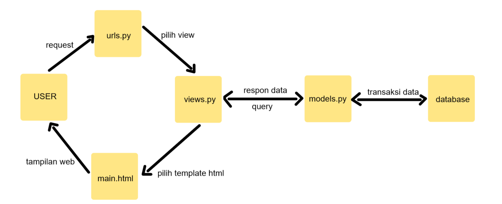

# Nama        : Rizqi Bayu Utama
# NPM         : 2206826330
# Kelas       : PBP - C

## Link Aplikasi
Link untuk Aplikasi [Bayu's Inventory](https://bayuinventory.adaptable.app/main/)


# Jawaban Tugas  2

### 1. Jelaskan bagaimana cara kamu mengimplementasikan checklist di atas secara step-by-step (bukan hanya sekadar mengikuti tutorial)
1. Pertama saya membuat projek django baru dan mengaktifkan virtual environment yang berguna untuk mengisolasi package serta dependencies dari aplikasi. Mengaktifkan virtual environment dengan perintah berikut:

    ```shell
    python -m venv env
    ```
    ```shell
    #Windows
    env\Scripts\activate.bat
    # Linux/Unix, e.g. Ubuntu, MacOS
    source env/bin/activate
    ```

2. Menyiapkan Dependencies (library, framework, package) dengan membuat requirements.txt 
    - jalankan perintah:

    ```shell
    pip install -r requirements.txt
    ```

    - dan buat proyek Django bernama BayuInventory dengan perintah:

    ```shell
    django-admin startproject BayuInventory
    ```

3. Mengonfigurasi proyek dan menjalankan server
    - Menambahkan `"*"` pada `ALLOWED_HOST` di `settings.py` untuk keperluan deploy
    - Menjalankan command:

    ```shell
    python manage.py runserver 
    ``` 

    - cek di http://localhost:8000 untuk melihat apakah berhasil atau tidak

4. Membuat aplikasi main dalam Proyek
    - jalankan 
    ```shell
    python manage.py startapp main
    ```

    - Mendaftarkan aplikasi `main` pada `INSTALLED_APPS` di `settings.py`

5. Buat direktori bernama `templates` didalam direktori main dan buat file `main.html` yang akan berisi template bagaimana tampilan web nanti

6. Mengubah `models.py` sesuai dengan yang dibutuhkan atau diinginkan

7. Membuat dan mengaplikasikan Migrasi Model
    - melakukannya dengan cara menjalankan perintah 

    ```shell 
    python manage.py makemigrations
    ```
    - Penerapan migrasi dengan

    ```shell
    python manage.py migrate 
    ```

8. Menghubungkan views dengan template
    - Tambahkan code berikut pada `views.py` di dalam aplikasi `main` 

    ```shell
    from django.shortcuts import render 
    ```

    - Menambahkan fungsi show_main yang akan mengembalikan tampilan yang sesuai

9. Konfigurasi URL
    - Konfigurasi url agar aplikasi main dapat diakses melalui web
    - jalankan proyek 

10. Melakukan Deploy pada Adaptable

### 2. Buatlah bagan yang berisi request client ke web aplikasi berbasis Django beserta responnya dan jelaskan pada bagan tersebut kaitan antara urls.py, views.py, dan models.py, dan berkas html



### 3. Jelaskan mengapa kita menggunakan virtual environment, apakah bisa membuat aplikasi web berbasis Django tanpa virtual environment?

Alasan menggunakan virtual environment adalah agar ketika rilis Django versi baru kita tetap dapat menjalankan aplikasi kita tanpa masalah seperti masalah perubahan fungsi ataupun tidak bisa berjalan pada modul terbaru. 

Kita tetap bisa membuat aplikasi web berbasis Django tanpa virtual environment, namun dengan resiko seperti yang sudah dijelaskan diatas.

### 4. Jelaskan apakah itu MVC, MVT, MVVM dan perbedaan ketiganya
- MVT: arsitektur untuk memisahkan konponen utama dari sebuah aplikasi (Model, View, Template)
- MVC: framework yang memisahkan aplikasi menjadi 3 logical components (Model, View, Controller)
- MVVM: arsitektur yang memisahkan code menjadi 3 bagian (Model, View, ViewModel)

    Perbedaaan: MVT lebih sederhana dengan Template yang fokus pada tampilan, MVC menggunakan Controller untuk mengendalikan alur aplikasi, sedangkan MVVM memperkenalkan ViewModel untuk mengelola tampilan dan memisahkan logika bisnis dari tampilan. 

# Jawaban Tugas 3

### 1. Perbedaan antara form `POST` dan form `GET` dalam Django?
- **`POST`**:
    - Mengirim informasi ke tujuan tanpa menampilkannya pada URL
    - Variabel `$_POST` menampung informasi yang dikirim
    - Memungkinkan pengiriman informasi dalam jumlah besar tanpa batasan khusus
- **`GET`**:
    - Mengirim informasi dengan menampilkan data di URL
    - Variabel `$_GET` menampung informasi dari URL
    - Keterbatasan panjang URL: hingga 2047 karakter

### 2. Perbedaan antara `XML`, `JSON`, dan `HTML` dalam konteks pengiriman data?
- **`XML`**:
    - Fasilitasi pertukaran data dengan format yang kuat melalui tag-tag khusus
    - Berguna untuk konfigurasi aplikasi dan integrasi lintas platform

- **`JSON`**:
    - Menyajikan data dengan format intuitif, menyerupai notasi objek
    - Ideal untuk komunikasi web dan API

- **`HTML`**:
    - Fokus pada tampilan konten di browser
    - Mengatur tampilan dan interaksi konten

### 3. Mengapa JSON sering digunakan dalam pertukaran data antara aplikasi web modern?
- **Ringkas dan Mudah Dibaca.**
- **Mendukung Struktur Data yang Kompleks.** 
- **Ringan dan Efisien.**
- **Responsif untuk Aplikasi Web.**

### 4. Jelaskan bagaimana mengimplementasikan checklist di atas secara step-by-step